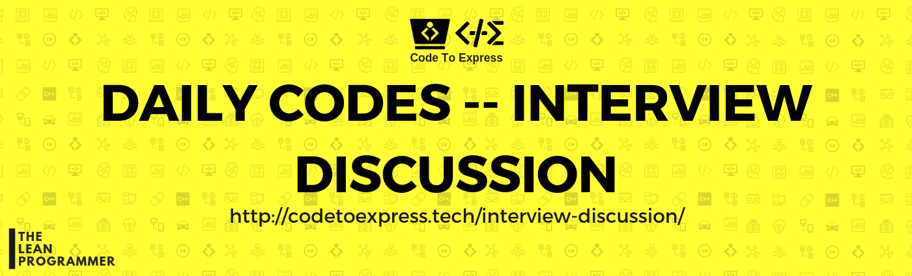

# Daily Codes Initiative

> With a huge demand for developers, competitive programming, algorithms, data structures etc has become a second choice for college students these days, although algorithmic scripting is an essential domain, not only for a student but for every individual who aspires to be a Computer Science Engineer!

I aim to bring back the importance of data structures, algorithms and practicing coding daily in the lives of coders once again! Hence I have started this Daily Codes initiative. [https://github.com/CodeToExpress/dailycodebase](https://github.com/CodeToExpress/dailycodebase)

Also, at the end of the day we will also discuss some common questions asked in the interviews (one question a day) so that in the given time frame of 60 days, one does not only get prepared technically for an interview but also be prepared mentally about the questions that can be asked.

Therefore, this is the repository for the daily codes interview discussion, where I'll be writing what I find, and everyone is open to tell their views (using issues).

Please note that, I (@MadhavBahlMD) will be writing the methods and answers which I found good by exploring various resources, but of course, I am not an expert, so I would be more than happy if you give your views on the questions in the comment section as well. Happy Learning ✨

## Discussion Time

- [Day 1 -- Things to keep in mind during an interview](./day1/)
- [Day 2 -- Tell me about yourself](./day2/)
- [Day 3 -- What are your strengths](./day3/)
- [Day 4 -- What are your weaknesses](./day4/)
- [Day 5 -- How to get a job in top coding companies](./day5/)
- [Day 6 -- What do you know about the company](./day6/)
- [Day 7 -- Whiteboard Interview Setting](./day7/)
- [Day 8 -- How to approach coding question when you are under pressure](./day8/)
- [Day 9 -- The "in-interview" silence](./day9/)
- [Day 10 -- The Post-Interview Silence](./day10/)
- [Day 11 -- What questions should I ask my interviewer](./day11/)
- [Day 12 -- Things to avoid during an interview](./day12/)

### Special Thanks

A huge shoutout to various sources from where I learned and increased my knowledge about how one should give interviews and the various important interview questions

- https://www.themuse.com/advice/how-to-answer-the-31-most-common-interview-questions
- http://insidetech.monster.com/careers/articles/4149-100-interview-questions-you-should-be-prepared-to-answer
- https://www.monsterindia.com/career-advice/top-100-interview-questions-to-help-you-succeed-in-a-job-interview-6943.html- https://www.monster.com/career-advice/article/100-potential-interview-questions
- https://soulsearch.files.wordpress.com/2007/05/64interviewquestions1.pdf
- https://www.naukri.com/blog/frequently-asked-hr-interview-questions-and-answers/

I am really grateful to these resources and hence I want to give them credits.