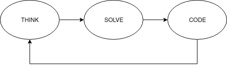

# Today's Topic of discussion

"How do you approach any coding question when you are under pressure"

Yesterday we discussed about the whiteboard interviews, we also noticed some points on how can you ace your next whiteboard interview. But is it that easy? No. Even with full preparation, and endless mock interviews people fail to give their best in real whiteboard interviews. Why? They are under pressure, it is completely ok to feel stress and anxiety while giving the interview, no one is perfect. 

Most of the people are either scared, anxious, stressed, or under pressure of internal compulsion to give their best. These emotions can have a bad impact on your problem-solving capabilities. So how to approach a problem given these conditions? My views are:

Think -> Solve -> Code repeat!

Yes, when under these type of situations, 

👉 clear your mind a bit

👉 Think about the problem

👉 Take a sample input and try to solve the given question using that input

👉 Convert your thinking into code

👉 repeat if you find something wrong or you get stuck

When you start solving the problem using some sample input, you actually start figuring ouot some ways on how the problem can be solved, so I personally love this approach of problem solving 😁